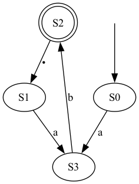

# Regex Parser \& Interpreter

## Synopsis

- A regex **parser \& interpreter** for a minimal language (subset of `POSIX`):
    ```
    r1,r2 ::= ε | a | . | r1* | r1+ | r1r2 
    ```
    - I.e. empty string, *alphanumeric* literals, `.` (any such literal),
      Kleene$\ast$, one-or-more ($+$), concatenation
- Matches input text on regex in a *repl* (CLI programme)
- Library for further extension
- Visualizer for underlying datastructure using a markup language `dot`

## Usage

```sh
make          # creates regexp, regexp-test 
./regexp      # run programme's repl
./regexp-test # run test suite
```

When running the repl, it writes locally `dfa.dot`, `nfa.dot`,
`powerSetDFA.dot` which represent the internal data structures.
These are written in the [`dot`](https://graphviz.org/doc/info/lang.html)
markup and can be compiled to a format free of choice (e.g., SVG, PNG).

### Sample usage

```txt
>> (ab.)*ab
>? abxabyab
Checking "abcdcd" on "ab(cd)*" results in: True
...
```

#### Equivalent DFA



> Using the `dot` binary, one can compile [`dfa.dot`](docs/dfa.dot) via
> ```sh
> dot -Tpng dfa.dot -o dfa.png
> ```

## Design

> *Note:* read [`API.md`](docs/API.md) for further implementation details.

- Our project reads, *parses* and *evaluates* a **regular expression**
- Two main components:
    - **Parsing**: Tokenizing the string
    - **Evaluation**: Producing and running a state machine (equivalent to the
      string)

**Goal**: interface `match :: RegPattern -> String -> Bool` which checks
if given input string matches a regex pattern.

### Parsing

- Parsing of strings via `Parsing.hs`
- Interface: `Parser.parseReg :: String -> Maybe Regex`
- Tokenizion results in a recursive datatype `Regex`:
    ```hs 
    data Regex
        = Epsilon
        | Literal Char
        | Kleene Regex
        | Concat Regex Regex
        | Dot
    ```

### Evaluation

- The tokenized string is translated to a deterministic finite automaton (*DFA*)
- This requires:
    1. creating an $\epsilon$-NFA from a Regex,
    2. creating a DFA from an $\epsilon$-NFA,
        1. creating an $\epsilon$-closure, and
        2. creating a *cleaned-up* DFA from a previous DFA (with multistates).
    3. *Running* an input string against the DFA.

```haskell
-- Top-level API in @Regex@
match :: RegPattern -> String -> Bool
match p s = case P.parseReg p of
    Just reg -> match1 reg s
    _        -> False

match1 :: P.Regex -> String -> Bool
match1 pattern input =
    let dfa = (DFA.fromNFA . NFA.fromRegex) pattern in 
        check dfa input

check :: DFA -> String -> Bool
check = ...
```

- `check` runs a simple traversal on the DFA, and checks whether it can read
  the entire sequence and finish in an accepting state.
- We branch out whenever we encounter the `.` "wildcard" (we handle it
  explicitly!)
