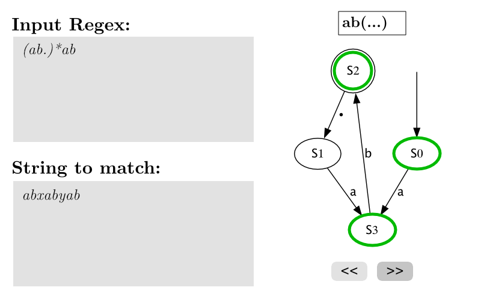

# TDA452 Functional programming

### Project - Regex Parsing

Chalmers University of Technology
$\cdot$ Michal Spano, Philipp-Immanuel Holst

---

## What Is This?

- A regex **parser \& interpreter** for a minimal language (subset of `POSIX`):
    ```
    r1,r2 ::= ε | a | . | r1* | r1+ | r1r2 
    ```
    - I.e. empty string, *alphanumeric* literals, `.` (any such literal), Kleene$\ast$, one-or-more ($+$), concatenation
- Matches input text on regex in a *repl* (CLI)
    ```txt
    λ> main
    >> (ab.)*ab
    >? abxabyab
    Checking "abxabyab" on "(ab.)*ab" results in: True
    ...
    ```
- Library for further extension
- Visualizer for underlying datastructure using a markup language `dot`

---

# Overview

- Our project reads, *parses* and *evaluates* a **regular expression**
- Two main components:
    - **Parsing**: Tokenizing the string
    - **Evaluation**: Producing and running a state machine (equivalent to the string)

**Goal**: interface `match :: RegPattern -> String -> Bool` which checks
if given input string matches a regex pattern.

--- 

# Parsing

## Internal representation

- Parsing of strings via `Parsing.hs`
- Interface: `Parser.parseReg :: String -> Maybe Regex`
- Tokenizion results in a recursive datatype `Regex`:
    ```hs 
    data Regex
        = Epsilon
        | Literal Char
        | Kleene Regex
        | Concat Regex Regex
        | Dot
    ```
    > Earlier problems of left-recursion are avoided by using specific *disjoint* parsers for each topen-type.

--- 

# Evaluating a `Regex`

## Generalized process

- The tokenized string is translated to a deterministic finite automaton (*DFA*)
- This requires:
    1. creating an $\epsilon$-NFA from a Regex,
    2. creating a DFA from an $\epsilon$-NFA,
        1. creating an $\epsilon$-closure, and
        2. creating a *cleaned-up* DFA from a previous DFA (with multistates).
    3. *Running* an input string against the DFA.

--- 

# Evaluating a `Regex`

## Datastructures 

- State machines: **graphs** with an entry points, accepting states, and a labeled transition system.
    - States: integers,
    - Transitions: maps s.t. $s_1 \to^{\text{literal}} s_2$,
    - *Note*: datatypes differ slightly between the automata
- Factored out to a module - `DataTypes`
- Heavy use of self-made auxiliary datastructure `DefaultMap`

---

# Evaluating a `Regex`

## Creating an $\epsilon$-NFA

- Module `NFA` that exposes an interface `fromRegex :: Regex -> NFA`
- An `NFA` is a graph with exactly one entry point, one accepting state and with labeled transitions:
    ```haskell
    data NFA            = NFA State State NFATransitions
    type NFATransitions = DefaultMap State (DefaultMap Char [State])
    ```
    > Note: a transition from a state to another via the same literal is allowed, hence a **non-deterministic** automaton.
- The `NFA` is created via the *Thompson-construction* 
- The result is an $\epsilon$-NFA equivalent to the regular expression

--- 

## Creating a DFA

- A `DFA` has exactly one entry point, but a list of accepting states
    ```haskell
    data DFA            = DFA State [State] DFATransitions
    type DFATransitions = DefaultMap State (Map Char State)
    ```
    > Note: a transition from a state to another strictly by different literals.
- The `DFA` module exposes an interface 
    ```haskell
    fromNFA :: NFA -> DFA
    fromNFA = flattenToDFA . fromNFAMulti
    ```
- All the work is done via the *powerset-construction* in `fromNFAMulti` (with an intermediate DFA, `PowerSetDFA`)
    - A `MultiState` represents a set of states; this gets *flattened* to a regular DFA afterwards.

---

# Evaluating a `Regex`

```haskell
-- Top-level API
match :: RegPattern -> String -> Bool
match p s = case P.parseReg p of
    Just reg -> match1 reg s
    _        -> False

match1 :: P.Regex -> String -> Bool
match1 pattern input =
    let dfa = (DFA.fromNFA . NFA.fromRegex) pattern in 
        check dfa input

check :: DFA -> String -> Bool
check = ...
```

---

# Evaluating a `Regex`

### `check :: DFA -> String -> Bool`

- It runs a simple traversal on the DFA, and checks whether it can read the entire sequence and finish in an accepting state.
- We branch out whenever we encounter the `.` "wildcard" (we handle it explicitly!)
- *Bonus*: `checkWithTrace` keeps track of a trace, step-by-step, given the route of the traversal.
    ```haskell
    checkWithTrace :: DFA -> String -> (Bool, [(State, Bool)])
    ```
    - This will be useful in the future!

--- 

# **Example**:

# Let's run: `a*.+b`

--- 

# Applied Concepts \& Outline

- Focus on algorithms
- *Elegant* code requires monads: `State`, `IO`, or `Maybe`.
- Many uses of datastructures \& custom (recursive) datatypes (in-house `DefaultMap`, records, etc.).
- (*mostly*) related to our major
- Easily extensible in the future
- Lots of fun! \=)

---

## Future Plans

- Package the source via `Cabal`
- Extend testing to `QuickCheck`
- Extend the language (e.g., `reg1 | reg2`) + update parsing
- Build a frontend (website) - embed graphs
    - Animation for step-by-step traversal
    - Talk to server (this module); will emit graph resources
    - Useful for intricate patterns (e.g. for students)

---



---

# Thanks & Questions?